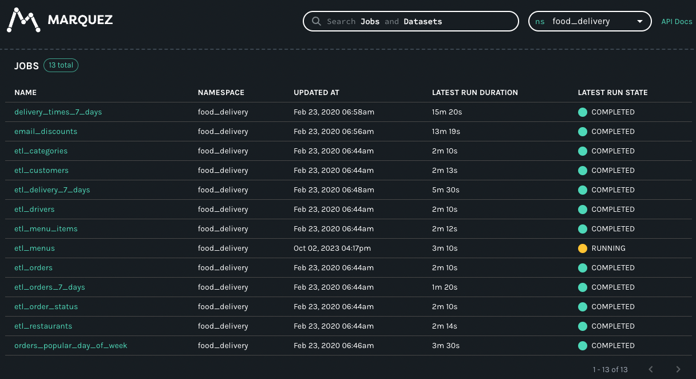

# Metadata Source

!!! example "Info"

    Generating data based on an external metadata source is a paid feature.

Creating a data generator for Postgres tables and CSV file based on metadata stored in Marquez (
follows [OpenLineage API](https://openlineage.io/)).

## Requirements

- 10 minutes
- Git
- Gradle
- Docker

## Get Started

First, we will clone the data-caterer-example repo which will already have the base project setup required.

```shell
git clone git@github.com:pflooky/data-caterer-example.git
```

### Marquez Setup

You can follow the README found [**here**](https://github.com/MarquezProject/marquez) to help with setting up Marquez in
your local environment. This comes with an instance of Postgres which we will also be using as a data store for
generated data.

The command that was run for this example to help with setup of dummy data was `./docker/up.sh -a 5001 -m 5002 --seed`.

Check that the following [url](http://localhost:3000) shows some data like below once you click on `food_delivery`
from the `ns` drop down in the top right corner.



#### Postgres Setup

Since we will also be using the Marquez Postgres instance as a data source, we will set up a separate database to store
the generated data in via:

```shell
docker exec marquez-db psql -Upostgres -c 'CREATE DATABASE food_delivery'
```

### Plan Setup

Create a new Java or Scala class.

- Java: `src/main/java/com/github/pflooky/plan/MyAdvancedMetadataSourceJavaPlanRun.java`
- Scala: `src/main/scala/com/github/pflooky/plan/MyAdvancedMetadataSourcePlanRun.scala`

Make sure your class extends `PlanRun`.

=== "Java"

    ```java
    import com.github.pflooky.datacaterer.java.api.PlanRun;
    ...
    
    public class MyAdvancedMetadataSourceJavaPlanRun extends PlanRun {
        {
            var conf = configuration().enableGeneratePlanAndTasks(true)
                .generatedReportsFolderPath("/opt/app/data/report");
        }
    }
    ```

=== "Scala"

    ```scala
    import com.github.pflooky.datacaterer.api.PlanRun
    ...
    
    class MyAdvancedMetadataSourcePlanRun extends PlanRun {
      val conf = configuration.enableGeneratePlanAndTasks(true)
        .generatedReportsFolderPath("/opt/app/data/report")
    }
    ```

We will enable generate plan and tasks so that we can read from external sources for metadata and save the reports
under a folder we can easily access.

#### Schema

We can point the schema of a data source to our Marquez instance. For the Postgres data source, we will point to a
`namespace`, which in Marquez or OpenLineage, represents a set of datasets. For the CSV data source, we will point to
a specific `namespace` and `dataset`.

##### Single Schema

=== "Java"

    ```java
    var csvTask = csv("my_csv", "/tmp/data/csv", Map.of("saveMode", "overwrite", "header", "true"))
            .schema(metadataSource().marquez("http://localhost:5001", "food_delivery", "public.delivery_7_days"))
            .count(count().records(10));
    ```

=== "Scala"

    ```scala
    val csvTask = csv("my_csv", "/tmp/data/csv", Map("saveMode" -> "overwrite", "header" -> "true"))
      .schema(metadataSource.marquez("http://localhost:5001", "food_delivery", "public.delivery_7_days"))
      .count(count.records(10))
    ```

The above defines that the schema will come from Marquez, which is a type of metadata source that contains information
about schemas. Specifically, it points to the `food_delivery` namespace and `public.categories` dataset to retrieve the
schema information from.

##### Multiple Schemas

=== "Java"

    ```java
    var postgresTask = postgres("my_postgres", "jdbc:postgresql://host.docker.internal:5432/food_delivery", "postgres", "password", Map.of())
        .schema(metadataSource().marquez("http://host.docker.internal:5001", "food_delivery"))
        .count(count().records(10));
    ```

=== "Scala"

    ```scala
    val postgresTask = postgres("my_postgres", "jdbc:postgresql://host.docker.internal:5432/food_delivery", "postgres", "password")
      .schema(metadataSource.marquez("http://host.docker.internal:5001", "food_delivery"))
      .count(count.records(10))
    ```

We now have pointed this Postgres instance to produce multiple schemas that are defined under the `food_delivery`
namespace. Also note that we are using database `food_delivery` in Postgres to push our generated data to, and we have
set the number of records per sub data source (in this case, per table) to be 10.

### Run

Let's try run and see what happens.

```shell
cd ..
./run.sh
#input class MyAdvancedMetadataSourceJavaPlanRun or MyAdvancedMetadataSourcePlanRun
#after completing
docker exec marquez-db psql -Upostgres -d food_delivery -c 'SELECT * FROM public.delivery_7_days'
```

It should look something like this.

```shell
 order_id |     order_placed_on     |   order_dispatched_on   |   order_delivered_on    |         customer_email         |                     customer_address                     | menu_id | restaurant_id |                        restaurant_address
   | menu_item_id | category_id | discount_id | city_id | driver_id
----------+-------------------------+-------------------------+-------------------------+--------------------------------+----------------------------------------------------------+---------+---------------+---------------------------------------------------------------
---+--------------+-------------+-------------+---------+-----------
    38736 | 2023-02-05 06:05:23.755 | 2023-09-08 04:29:10.878 | 2023-09-03 23:58:34.285 | april.skiles@hotmail.com       | 5018 Lang Dam, Gaylordfurt, MO 35172                     |   59841 |         30971 | Suite 439 51366 Bartoletti Plains, West Lashawndamouth, CA 242
42 |        55697 |       36370 |       21574 |   88022 |     16569
     4376 | 2022-12-19 14:39:53.442 | 2023-08-30 07:40:06.948 | 2023-03-15 20:38:26.11  | adelina.balistreri@hotmail.com | Apt. 340 9146 Novella Motorway, East Troyhaven, UT 34773 |   66195 |         42765 | Suite 670 8956 Rob Fork, Rennershire, CA 04524
   |        26516 |       81335 |       87615 |   27433 |     45649
    11083 | 2022-10-30 12:46:38.692 | 2023-06-02 13:05:52.493 | 2022-11-27 18:38:07.873 | johnny.gleason@gmail.com       | Apt. 385 99701 Lemke Place, New Irvin, RI 73305          |   66427 |         44438 | 1309 Danny Cape, Weimanntown, AL 15865
   |        41686 |       36508 |       34498 |   24191 |     92405
    58759 | 2023-07-26 14:32:30.883 | 2022-12-25 11:04:08.561 | 2023-04-21 17:43:05.86  | isabelle.ohara@hotmail.com     | 2225 Evie Lane, South Ardella, SD 90805                  |   27106 |         25287 | Suite 678 3731 Dovie Park, Port Luigi, ID 08250
   |        94205 |       66207 |       81051 |   52553 |     27483
```

You can also try query some other tables. Let's also check what is in the CSV file.

```shell
$ head docker/sample/csv/part-0000*
menu_item_id,category_id,discount_id,city_id,driver_id,order_id,order_placed_on,order_dispatched_on,order_delivered_on,customer_email,customer_address,menu_id,restaurant_id,restaurant_address
72248,37098,80135,45888,5036,11090,2023-09-20T05:33:08.036+08:00,2023-05-16T23:10:57.119+08:00,2023-05-01T22:02:23.272+08:00,demetrice.rohan@hotmail.com,"406 Harmony Rue, Wisozkburgh, MD 12282",33762,9042,"Apt. 751 0796 Ellan Flats, Lake Chetville, WI 81957"
41644,40029,48565,83373,89919,58359,2023-04-18T06:28:26.194+08:00,2022-10-15T18:17:48.998+08:00,2023-02-06T17:02:04.104+08:00,joannie.okuneva@yahoo.com,"Suite 889 022 Susan Lane, Zemlakport, OR 56996",27467,6216,"Suite 016 286 Derick Grove, Dooleytown, NY 14664"
49299,53699,79675,40821,61764,72234,2023-07-16T21:33:48.739+08:00,2023-02-14T21:23:10.265+08:00,2023-09-18T02:08:51.433+08:00,ina.heller@yahoo.com,"Suite 600 86844 Heller Island, New Celestinestad, DE 42622",48002,12462,"5418 Okuneva Mountain, East Blairchester, MN 04060"
83197,86141,11085,29944,81164,65382,2023-01-20T06:08:25.981+08:00,2023-01-11T13:24:32.968+08:00,2023-09-09T02:30:16.890+08:00,lakisha.bashirian@yahoo.com,"Suite 938 534 Theodore Lock, Port Caitlynland, LA 67308",69109,47727,"4464 Stewart Tunnel, Marguritemouth, AR 56791"
```

Looks like we have some data now. But we can do better and add some enhancements to it.
  
What if we wanted the same records in Postgres `public.delivery_7_days` to also show up in the CSV file? That's where we
can use a foreign key definition.

### Foreign Key

We can take a look at the report (under `docker/sample/report/index.html`) to see what we need to do to create the 
foreign key. From the overview, you should see under `Tasks` there is a `my_postgres` task which has 
`food_delivery_public.delivery_7_days` as a step. Click on the link for `food_delivery_public.delivery_7_days` and it 
will take us to a page where we can find out about the columns used in this table. Click on the `Fields` button on the 
far right to see.
  
We can copy all of a subset of fields that we want matched across the CSV file and Postgres. For this example, we will 
take all the fields.

=== "Java"

    ```java
    var myPlan = plan().addForeignKeyRelationship(
            postgresTask, List.of("key", "tmp_year", "tmp_name", "value"),
            List.of(Map.entry(csvTask, List.of("account_number", "year", "name", "payload")))
    );
  
    var conf = ...

    execute(myPlan, conf, postgresTask, csvTask);
    ```

=== "Scala"

    ```scala
    val foreignCols = List("order_id", "order_placed_on", "order_dispatched_on", "order_delivered_on", "customer_email",
      "customer_address", "menu_id", "restaurant_id", "restaurant_address", "menu_item_id", "category_id", "discount_id",
      "city_id", "driver_id")

    val myPlan = plan.addForeignKeyRelationships(
      csvTask, foreignCols,
      List(foreignField(postgresTask, "food_delivery_public.delivery_7_days", foreignCols))
    )
  
    val conf = ...

    execute(myPlan, conf, postgresTask, csvTask)
    ```

Notice how we have defined the `csvTask` and `foreignCols` as the main foreign key but for `postgresTask`, we had to 
define it as a `foreignField`. This is because `postgresTask` has multiple tables within it, and we only want to define
our foreign key with respect to the `public.delivery_7_days` table. We use the step name (can be seen from the report) 
to specify the table to target. 

To test this out, we will truncate the `public.delivery_7_days` table in Postgres first, and then try run again.

```shell
docker exec marquez-db psql -Upostgres -d food_delivery -c 'TRUNCATE public.delivery_7_days'
./run.sh
#input class MyAdvancedMetadataSourceJavaPlanRun or MyAdvancedMetadataSourcePlanRun
docker exec marquez-db psql -Upostgres -d food_delivery -c 'SELECT * FROM public.delivery_7_days'
```

```shell
 order_id |     order_placed_on     |   order_dispatched_on   |   order_delivered_on    |        customer_email        |
       customer_address                     | menu_id | restaurant_id |                   restaurant_address                   | menu
_item_id | category_id | discount_id | city_id | driver_id
----------+-------------------------+-------------------------+-------------------------+------------------------------+-------------
--------------------------------------------+---------+---------------+--------------------------------------------------------+-----
---------+-------------+-------------+---------+-----------
    53333 | 2022-10-15 08:40:23.394 | 2023-01-23 09:42:48.397 | 2023-08-12 08:50:52.397 | normand.aufderhar@gmail.com  | Apt. 036 449
27 Wilderman Forge, Marvinchester, CT 15952 |   40412 |         70130 | Suite 146 98176 Schaden Village, Grahammouth, SD 12354 |
   90141 |       44210 |       83966 |   78614 |     77449
```

Let's grab the first email from the Postgres table and check whether the same record exists in the CSV file.

```shell
$ cat docker/sample/csv/part-0000* | grep normand.aufderhar
90141,44210,83966,78614,77449,53333,2022-10-15T08:40:23.394+08:00,2023-01-23T09:42:48.397+08:00,2023-08-12T08:50:52.397+08:00,normand.aufderhar@gmail.com,"Apt. 036 44927 Wilderman Forge, Marvinchester, CT 15952",40412,70130,"Suite 146 98176 Schaden Village, Grahammouth, SD 12354"
```

Great! Now we have the ability to get schema information from an external source, add our own foreign keys and generate 
data.
  
Check out the full example under `AdvancedMetadataSourcePlanRun` in the example repo.
