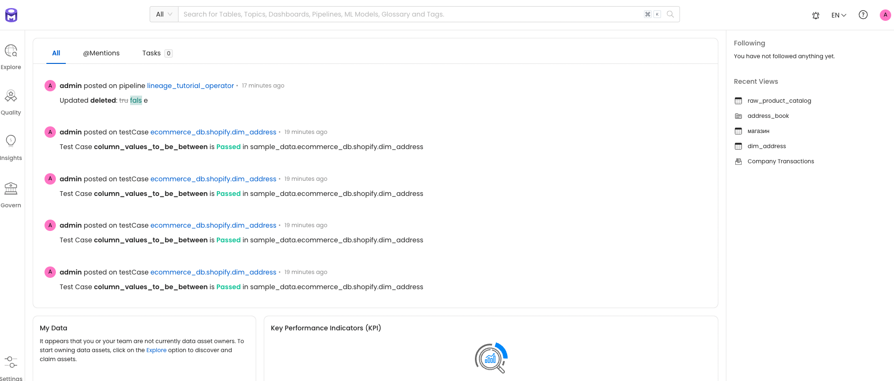

# OpenMetadata Source

!!! example "Info"

    Generating data based on an external metadata source is a paid feature. Try the free trial [here](../../../get-started/docker.md).

Creating a data generator for a JSON file based on metadata stored
in [OpenMetadata](https://github.com/open-metadata/OpenMetadata).

## Requirements

- 10 minutes
- Git
- Gradle
- Docker

## Get Started

First, we will clone the data-caterer-example repo which will already have the base project setup required.

```shell
git clone git@github.com:pflooky/data-caterer-example.git
```

### OpenMetadata Setup

You can follow the local docker setup found
[**here**](https://docs.open-metadata.org/v1.2.x/quick-start/local-docker-deployment) to help with setting up
OpenMetadata in your local environment.

If that page becomes outdated or the link doesn't work, below are the commands I used to run it:

```shell
mkdir openmetadata-docker && cd openmetadata-docker
curl -sL https://github.com/open-metadata/OpenMetadata/releases/download/1.2.0-release/docker-compose.yml > docker-compose.yml
docker compose -f docker-compose.yml up --detach
```

Check that the following [url](http://localhost:8585) works and login with `admin:admin`. Then you should see some data 
like below:



### Plan Setup

Create a new Java or Scala class.

- Java: `src/main/java/com/github/pflooky/plan/MyAdvancedOpenMetadataSourceJavaPlanRun.java`
- Scala: `src/main/scala/com/github/pflooky/plan/MyAdvancedOpenMetadataSourcePlanRun.scala`

Make sure your class extends `PlanRun`.

=== "Java"

    ```java
    import com.github.pflooky.datacaterer.java.api.PlanRun;
    ...
    
    public class MyAdvancedOpenMetadataSourceJavaPlanRun extends PlanRun {
        {
            var conf = configuration().enableGeneratePlanAndTasks(true)
                .generatedReportsFolderPath("/opt/app/data/report");
        }
    }
    ```

=== "Scala"

    ```scala
    import com.github.pflooky.datacaterer.api.PlanRun
    ...
    
    class MyAdvancedOpenMetadataSourcePlanRun extends PlanRun {
      val conf = configuration.enableGeneratePlanAndTasks(true)
        .generatedReportsFolderPath("/opt/app/data/report")
    }
    ```

We will enable generate plan and tasks so that we can read from external sources for metadata and save the reports
under a folder we can easily access.

#### Schema

We can point the schema of a data source to our OpenMetadata instance. We will use a JSON data source so that we can
show how nested data types are handled and how we could customise it.

##### Single Schema

=== "Java"

    ```java
    import com.github.pflooky.datacaterer.api.model.Constants;
    ...
    
    var jsonTask = json("my_json", "/opt/app/data/json", Map.of("saveMode", "overwrite"))
            .schema(metadataSource().openMetadataJava(
                "http://localhost:8585/api",                                                              //url
                Constants.OPEN_METADATA_AUTH_TYPE_OPEN_METADATA(),                                        //auth type
                Map.of(                                                                                   //additional options (including auth options)
                    Constants.OPEN_METADATA_JWT_TOKEN(), "abc123",                                        //get from settings/bots/ingestion-bot
                    Constants.OPEN_METADATA_TABLE_FQN(), "sample_data.ecommerce_db.shopify.raw_customer"  //table fully qualified name
                )
            ))
            .count(count().records(10));
    ```

=== "Scala"

    ```scala
    import com.github.pflooky.datacaterer.api.model.Constants.{OPEN_METADATA_AUTH_TYPE_OPEN_METADATA, OPEN_METADATA_JWT_TOKEN, OPEN_METADATA_TABLE_FQN, SAVE_MODE}
    ...
    
    val jsonTask = json("my_json", "/opt/app/data/json", Map("saveMode" -> "overwrite"))
      .schema(metadataSource.openMetadata(
        "http://localhost:8585/api",                                                  //url
        OPEN_METADATA_AUTH_TYPE_OPEN_METADATA,                                        //auth type
        Map(                                                                          //additional options (including auth options)
          OPEN_METADATA_JWT_TOKEN -> "abc123",                                        //get from settings/bots/ingestion-bot
          OPEN_METADATA_TABLE_FQN -> "sample_data.ecommerce_db.shopify.raw_customer"  //table fully qualified name
        )
      ))
      .count(count.records(10))
    ```

The above defines that the schema will come from OpenMetadata, which is a type of metadata source that contains
information about schemas. Specifically, it points to the `sample_data.ecommerce_db.shopify.raw_customer` table. You
can check out the schema [here](http://localhost:8585/table/sample_data.ecommerce_db.shopify.raw_customer/schema) to
see what it looks like.

### Run

Let's try run and see what happens.

```shell
cd ..
./run.sh
#input class MyAdvancedOpenMetadataSourceJavaPlanRun or MyAdvancedOpenMetadataSourcePlanRun
#after completing
cat docker/sample/json/part-00000-*
```

It should look something like this.

```json
{
  "comments": "Mh6jqpD5e4M",
  "creditcard": "6771839575926717",
  "membership": "Za3wCQUl9E  EJj712",
  "orders": [
    {
      "product_id": "Aa6NG0hxfHVq",
      "price": 16139,
      "onsale": false,
      "tax": 58134,
      "weight": 40734,
      "others": 45813,
      "vendor": "Kh"
    },
    {
      "product_id": "zbHBY ",
      "price": 17903,
      "onsale": false,
      "tax": 39526,
      "weight": 9346,
      "others": 52035,
      "vendor": "jbkbnXAa"
    },
    {
      "product_id": "5qs3gakppd7Nw5",
      "price": 48731,
      "onsale": true,
      "tax": 81105,
      "weight": 2004,
      "others": 20465,
      "vendor": "nozCDMSXRPH Ev"
    },
    {
      "product_id": "CA6h17ANRwvb",
      "price": 62102,
      "onsale": true,
      "tax": 96601,
      "weight": 78849,
      "others": 79453,
      "vendor": " ihVXEJz7E2EFS"
    }
  ],
  "platform": "GLt9",
  "preference": {
    "key": "nmPmsPjg C",
    "value": true
  },
  "shipping_address": [
    {
      "name": "Loren Bechtelar",
      "street_address": "Suite 526 293 Rohan Road, Wunschshire, NE 25532",
      "city": "South Norrisland",
      "postcode": "56863"
    }
  ],
  "shipping_date": "2022-11-03",
  "transaction_date": "2023-02-01",
  "customer": {
    "username": "lance.murphy",
    "name": "Zane Brakus DVM",
    "sex": "7HcAaPiO",
    "address": "594 Loida Haven, Gilland, MA 26071",
    "mail": "Un3fhbvK2rEbenIYdnq",
    "birthdate": "2023-01-31"
  }
}
```

Looks like we have some data now. But we can do better and add some enhancements to it.

### Custom metadata

We can see from the data generated, that it isn't quite what we want. The metadata is not sufficient for us to produce
production-like data yet. Let's try to add some enhancements to it.

Let's make the `platform` field a choice field that can only be a set of certain values and the nested
field `customer.sex` is also from a predefined set of values.

=== "Java"

    ```java
    var jsonTask = json("my_json", "/opt/app/data/json", Map.of("saveMode", "overwrite"))
                .schema(
                    metadata...
                ))
                .schema(
                    field().name("platform").oneOf("website", "mobile"),
                    field().name("customer").schema(field().name("sex").oneOf("M", "F", "O"))
                )
                .count(count().records(10));
    ```

=== "Scala"

    ```scala
    val jsonTask = json("my_json", "/opt/app/data/json", Map("saveMode" -> "overwrite"))
      .schema(
        metadata...
      ))
      .schema(
        field.name("platform").oneOf("website", "mobile"),
        field.name("customer").schema(field.name("sex").oneOf("M", "F", "O"))
      )
      .count(count.records(10))
    ```

Let's test it out by running it again

```shell
./run.sh
#input class MyAdvancedMetadataSourceJavaPlanRun or MyAdvancedMetadataSourcePlanRun
cat docker/sample/json/part-00000-*
```

```json
{
  "comments": "vqbPUm",
  "creditcard": "6304867705548636",
  "membership": "GZ1xOnpZSUOKN",
  "orders": [
    {
      "product_id": "rgOokDAv",
      "price": 77367,
      "onsale": false,
      "tax": 61742,
      "weight": 87855,
      "others": 26857,
      "vendor": "04XHR64ImMr9T"
    }
  ],
  "platform": "mobile",
  "preference": {
    "key": "IB5vNdWka",
    "value": true
  },
  "shipping_address": [
    {
      "name": "Isiah Bins",
      "street_address": "36512 Ross Spurs, Hillhaven, IA 18760",
      "city": "Averymouth",
      "postcode": "75818"
    },
    {
      "name": "Scott Prohaska",
      "street_address": "26573 Haley Ports, Dariusland, MS 90642",
      "city": "Ashantimouth",
      "postcode": "31792"
    },
    {
      "name": "Rudolf Stamm",
      "street_address": "Suite 878 0516 Danica Path, New Christiaport, ID 10525",
      "city": "Doreathaport",
      "postcode": "62497"
    }
  ],
  "shipping_date": "2023-08-24",
  "transaction_date": "2023-02-01",
  "customer": {
    "username": "jolie.cremin",
    "name": "Fay Klein",
    "sex": "O",
    "address": "Apt. 174 5084 Volkman Creek, Hillborough, PA 61959",
    "mail": "BiTmzb7",
    "birthdate": "2023-04-07"
  }
}
```

Great! Now we have the ability to get schema information from an external source, add our own metadata and generate 
data.

### Data validation

Another aspect of OpenMetadata that can be leveraged is the definition of data quality rules. These rules can be 
incorporated into your Data Caterer job as well by enabling data validations via `enableGenerateValidations` in 
`configuration`.

=== "Java"

    ```java
    var conf = configuration().enableGeneratePlanAndTasks(true)
        .enableGenerateValidations(true)
        .generatedReportsFolderPath("/opt/app/data/report");

    execute(conf, jsonTask);
    ```

=== "Scala"

    ```scala
    val conf = configuration.enableGeneratePlanAndTasks(true)
      .enableGenerateValidations(true)
      .generatedReportsFolderPath("/opt/app/data/report")
    
    execute(conf, jsonTask)
    ```

Check out the full example under `AdvancedOpenMetadataSourcePlanRun` in the example repo.
