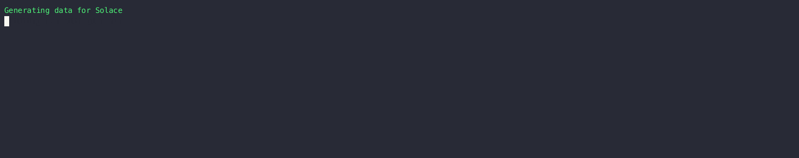
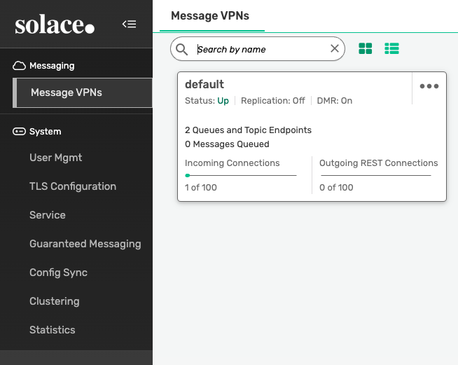
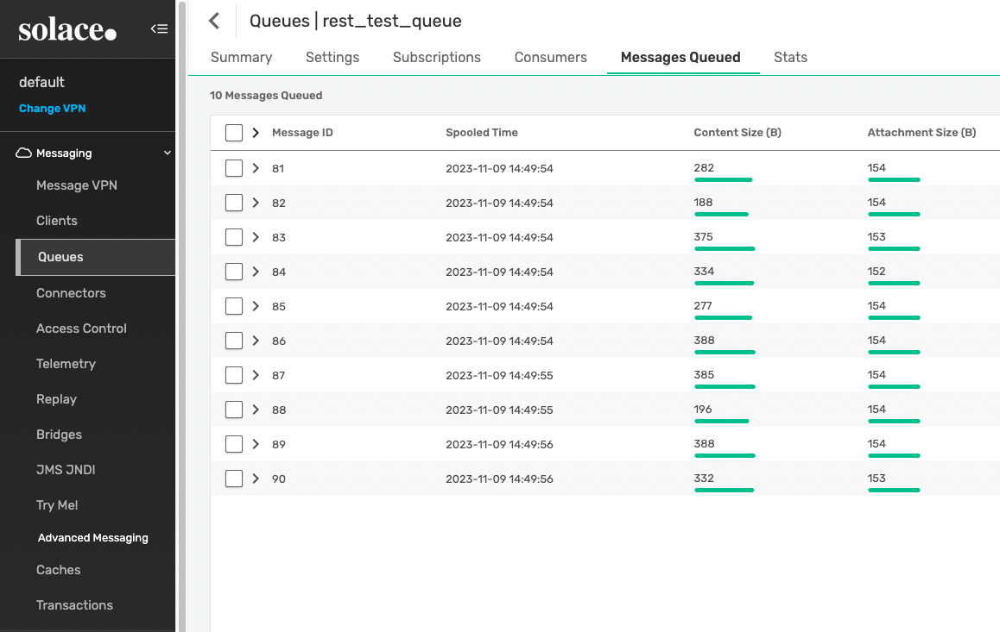

# Solace

!!! example "Info"

    Writing data to Solace is a paid feature. Try the free trial [here](../../../get-started/docker.md).

Creating a data generator for Solace. You will build a Docker image that will be able to populate data in Solace
for the queues/topics you configure.



## Requirements

- 20 minutes
- Git
- Gradle
- Docker
- Solace

## Get Started

First, we will clone the data-caterer-example repo which will already have the base project setup required.

```shell
git clone git@github.com:pflooky/data-caterer-example.git
```

If you already have a Solace instance running, you can skip to [this step](#plan-setup).

### Solace Setup

Next, let's make sure you have an instance of Solace up and running in your local environment. This will make it
easy for us to iterate and check our changes.

```shell
cd docker
docker-compose up -d solace
```

Open up [localhost:8080](http://localhost:8080) and login with `admin:admin` and check there is the `default` VPN like
below. Notice there is 2 queues/topics created. If you do not see 2 created, try to run the script found under
`docker/data/solace/setup_solace.sh` and change the `host` to `localhost`.



### Plan Setup

Create a new Java or Scala class.

- Java: `src/main/java/com/github/pflooky/plan/MyAdvancedSolaceJavaPlan.java`
- Scala: `src/main/scala/com/github/pflooky/plan/MyAdvancedSolacePlan.scala`

Make sure your class extends `PlanRun`.

=== "Java"

    ```java
    import com.github.pflooky.datacaterer.java.api.PlanRun;
    
    public class MyAdvancedSolaceJavaPlan extends PlanRun {
    }
    ```

=== "Scala"

    ```scala
    import com.github.pflooky.datacaterer.api.PlanRun
    
    class MyAdvancedSolacePlan extends PlanRun {
    }
    ```

This class defines where we need to define all of our configurations for generating data. There are helper variables and
methods defined to make it simple and easy to use.

#### Connection Configuration

Within our class, we can start by defining the connection properties to connect to Solace.

=== "Java"

    ```java
    var accountTask = solace(
        "my_solace",                        //name
        "smf://host.docker.internal:55554", //url
        Map.of()                            //optional additional connection options
    );
    ```
    
    Additional connection options can be found [**here**](../../connection.md#jms).

=== "Scala"

    ```scala
    val accountTask = solace(
        "my_solace",                        //name
        "smf://host.docker.internal:55554", //url
        Map()                               //optional additional connection options
    )
    ```
    
    Additional connection options can be found [**here**](../../connection.md#jms).

#### Schema

Let's create a task for inserting data into the `rest_test_queue` or `rest_test_topic` that is already created for us
from this [step](#solace-setup).

Trimming the connection details to work with the docker-compose Solace, we have a base Solace connection to define
the JNDI destination we will publish to. Let's define each field along with their corresponding data type. You will
notice
that the `text` fields do not have a data type defined. This is because the default data type is `StringType`.

=== "Java"

    ```java
    {
        var solaceTask = solace("my_solace", "smf://host.docker.internal:55554")
                .destination("/JNDI/Q/rest_test_queue")
                .schema(
                        field().name("value").sql("TO_JSON(content)"),
                        //field().name("partition").type(IntegerType.instance()),   //can define message JMS priority here
                        field().name("headers")                                     //set message properties via headers field
                                .type(HeaderType.getType())
                                .sql(
                                        "ARRAY(" +
                                                "NAMED_STRUCT('key', 'account-id', 'value', TO_BINARY(content.account_id, 'utf-8'))," +
                                                "NAMED_STRUCT('key', 'updated', 'value', TO_BINARY(content.details.updated_by.time, 'utf-8'))" +
                                                ")"
                                ),
                        field().name("content")
                                .schema(
                                        field().name("account_id").regex("ACC[0-9]{8}"),
                                        field().name("year").type(IntegerType.instance()).min(2021).max(2023),
                                        field().name("amount").type(DoubleType.instance()),
                                        field().name("details")
                                                .schema(
                                                        field().name("name").expression("#{Name.name}"),
                                                        field().name("first_txn_date").type(DateType.instance()).sql("ELEMENT_AT(SORT_ARRAY(content.transactions.txn_date), 1)"),
                                                        field().name("updated_by")
                                                                .schema(
                                                                        field().name("user"),
                                                                        field().name("time").type(TimestampType.instance())
                                                                )
                                                ),
                                        field().name("transactions").type(ArrayType.instance())
                                                .schema(
                                                        field().name("txn_date").type(DateType.instance()).min(Date.valueOf("2021-01-01")).max("2021-12-31"),
                                                        field().name("amount").type(DoubleType.instance())
                                                )
                                )
                )
                .count(count().records(10));
    }
    ```

=== "Scala"

    ```scala
    val solaceTask = solace("my_solace", "smf://host.docker.internal:55554")
      .destination("/JNDI/Q/rest_test_queue")
      .schema(
        field.name("value").sql("TO_JSON(content)"),
        //field.name("partition").`type`(IntegerType),  //can define message JMS priority here
        field.name("headers")                           //set message properties via headers field
          .`type`(HeaderType.getType)
          .sql(
            """ARRAY(
              |  NAMED_STRUCT('key', 'account-id', 'value', TO_BINARY(content.account_id, 'utf-8')),
              |  NAMED_STRUCT('key', 'updated', 'value', TO_BINARY(content.details.updated_by.time, 'utf-8'))
              |)""".stripMargin
          ),
        field.name("content")
          .schema(
            field.name("account_id").regex("ACC[0-9]{8}"),
            field.name("year").`type`(IntegerType).min(2021).max(2023),
            field.name("amount").`type`(DoubleType),
            field.name("details")
              .schema(
                field.name("name").expression("#{Name.name}"),
                field.name("first_txn_date").`type`(DateType).sql("ELEMENT_AT(SORT_ARRAY(content.transactions.txn_date), 1)"),
                field.name("updated_by")
                  .schema(
                    field.name("user"),
                    field.name("time").`type`(TimestampType),
                  ),
              ),
            field.name("transactions").`type`(ArrayType)
              .schema(
                field.name("txn_date").`type`(DateType).min(Date.valueOf("2021-01-01")).max("2021-12-31"),
                field.name("amount").`type`(DoubleType),
              )
          ),
      ).count(count.records(10))
    ```

#### Fields

The schema defined for Solace has a format that needs to be followed as noted above. Specifically, the required fields
are:

- value

Whilst, the other fields are optional:

- partition - refers to JMS priority of the message
- headers - refers to JMS message properties

##### headers

`headers` follows a particular pattern that where it is of type `HeaderType.getType` which behind the scenes, translates
to`array<struct<key: string,value: binary>>`. To be able to generate data for this data type, we need to use an SQL
expression like the one below. You will notice that in the`value` part, it refers to `content.account_id` where 
`content` is another field defined at the top level of the schema. This allows you to reference other values that have 
already been generated.

=== "Java"

    ```java
    field().name("headers")
            .type(HeaderType.getType())
            .sql(
                    "ARRAY(" +
                            "NAMED_STRUCT('key', 'account-id', 'value', TO_BINARY(content.account_id, 'utf-8'))," +
                            "NAMED_STRUCT('key', 'updated', 'value', TO_BINARY(content.details.updated_by.time, 'utf-8'))" +
                            ")"
            )
    ```

=== "Scala"

    ```scala
    field.name("headers")
      .`type`(HeaderType.getType)
      .sql(
        """ARRAY(
          |  NAMED_STRUCT('key', 'account-id', 'value', TO_BINARY(content.account_id, 'utf-8')),
          |  NAMED_STRUCT('key', 'updated', 'value', TO_BINARY(content.details.updated_by.time, 'utf-8'))
          |)""".stripMargin
      )
    ```

##### transactions

`transactions` is an array that contains an inner structure of `txn_date` and `amount`. The size of the array generated
can be controlled via `arrayMinLength` and `arrayMaxLength`.

=== "Java"

    ```java
    field().name("transactions").type(ArrayType.instance())
            .schema(
                    field().name("txn_date").type(DateType.instance()).min(Date.valueOf("2021-01-01")).max("2021-12-31"),
                    field().name("amount").type(DoubleType.instance())
            )
    ```

=== "Scala"

    ```scala
    field.name("transactions").`type`(ArrayType)
      .schema(
        field.name("txn_date").`type`(DateType).min(Date.valueOf("2021-01-01")).max("2021-12-31"),
        field.name("amount").`type`(DoubleType),
      )
    ```

##### details

`details` is another example of a nested schema structure where it also has a nested structure itself in `updated_by`.
One thing to note here is the `first_txn_date` field has a reference to the `content.transactions` array where it will
sort the array by `txn_date` and get the first element.

=== "Java"

    ```java
    field().name("details")
            .schema(
                    field().name("name").expression("#{Name.name}"),
                    field().name("first_txn_date").type(DateType.instance()).sql("ELEMENT_AT(SORT_ARRAY(content.transactions.txn_date), 1)"),
                    field().name("updated_by")
                            .schema(
                                    field().name("user"),
                                    field().name("time").type(TimestampType.instance())
                            )
            )
    ```

=== "Scala"

    ```scala
    field.name("details")
      .schema(
        field.name("name").expression("#{Name.name}"),
        field.name("first_txn_date").`type`(DateType).sql("ELEMENT_AT(SORT_ARRAY(content.transactions.txn_date), 1)"),
        field.name("updated_by")
          .schema(
            field.name("user"),
            field.name("time").`type`(TimestampType),
          ),
      )
    ```

#### Additional Configurations

At the end of data generation, a report gets generated that summarises the actions it performed. We can control the
output folder of that report via configurations.

=== "Java"

    ```java
    var config = configuration()
            .generatedReportsFolderPath("/opt/app/data/report");
    ```

=== "Scala"

    ```scala
    val config = configuration
      .generatedReportsFolderPath("/opt/app/data/report")
    ```

#### Execute

To tell Data Caterer that we want to run with the configurations along with the `kafkaTask`, we have to call `execute`.

### Run

Now we can run via the script `./run.sh` that is in the top level directory of the `data-caterer-example` to run the
class we just created.

```shell
./run.sh
#input class AdvancedSolaceJavaPlanRun or AdvancedSolacePlanRun
#after completing, check http://localhost:8080 from browser
```

Your output should look like this.



Unfortunately, there is no easy way to see the message content. You can check the message content from your application
or service that consumes these messages.

Also check the HTML report, found at `docker/sample/report/index.html`, that gets generated to get an overview of what
was executed. Or view the sample report found [here](../../../sample/report/html/index.html).
