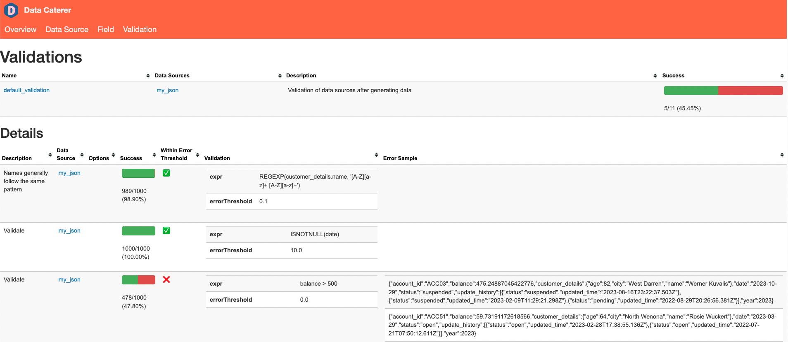

# Data Validations

Creating a data validator for a JSON file.



## Requirements

- 5 minutes
- Git
- Gradle
- Docker

## Get Started

First, we will clone the data-caterer-example repo which will already have the base project setup required.

```shell
git clone git@github.com:pflooky/data-caterer-example.git
```

### Data Setup

To aid in showing the functionality of data validations, we will first generate some data that our validations will run
against. Run the below command and it will generate JSON files under `docker/sample/json` folder.

```shell
./run.sh JsonPlan
```

### Plan Setup

Create a new Java or Scala class.

- Java: `src/main/java/com/github/pflooky/plan/MyValidationJavaPlan.java`
- Scala: `src/main/scala/com/github/pflooky/plan/MyValidationPlan.scala`

Make sure your class extends `PlanRun`.

=== "Java"

    ```java
    import com.github.pflooky.datacaterer.java.api.PlanRun;
    ...
    
    public class MyValidationJavaPlan extends PlanRun {
        {
            var jsonTask = json("my_json", "/opt/app/data/json");

            var config = configuration()
                    .generatedReportsFolderPath("/opt/app/data/report")
                    .enableValidation(true)
                    .enableGenerateData(false);
    
            execute(config, jsonTask);
        }
    }
    ```

=== "Scala"

    ```scala
    import com.github.pflooky.datacaterer.api.PlanRun
    ...
    
    class MyValidationPlan extends PlanRun {
      val jsonTask = json("my_json", "/opt/app/data/json")

      val config = configuration
        .generatedReportsFolderPath("/opt/app/data/report")
        .enableValidation(true)
        .enableGenerateData(false)
      
      execute(config, jsonTask)
    }
    ```

As noted above, we create a JSON task that points to where the JSON data has been created at folder `/opt/app/data/json`
. We also note that `enableValidation` is set to `true` and `enableGenerateData` to `false` to tell Data Catering, we
only want to validate data.

### Validations

For reference, the schema in which we will be validating against looks like the below.

```shell
.schema(
  field.name("account_id"),
  field.name("year").`type`(IntegerType),
  field.name("balance").`type`(DoubleType),
  field.name("date").`type`(DateType),
  field.name("status"),
  field.name("update_history").`type`(ArrayType)
    .schema(
      field.name("updated_time").`type`(TimestampType),
      field.name("status").oneOf("open", "closed", "pending", "suspended"),
    ),
  field.name("customer_details")
    .schema(
      field.name("name").expression("#{Name.name}"),
      field.name("age").`type`(IntegerType),
      field.name("city").expression("#{Address.city}")
    )
)
```

#### Basic Validation

Let's say our goal is to validate the `customer_details.name` field to ensure it conforms to the regex
pattern `[A-Z][a-z]+ [A-Z][a-z]+`. Given the diversity in naming conventions across cultures and countries, variations
such as middle names, suffixes, prefixes, or language-specific differences are tolerated to a certain extent. The
validation considers an acceptable error threshold before marking it as failed.

##### Validation Criteria

- Field to Validate: `customer_details.name`
- Regex Pattern: `[A-Z][a-z]+ [A-Z][a-z]+`
- Error Tolerance: If more than 10% do not match the regex, then fail.

##### Considerations

- Customisation
    - Adjust the regex pattern and error threshold based on your specific data schema and validation requirements.
    - For the full list of types of basic validations that can be
      used, [check this page](../../../setup/validation/basic-validation.md).
- Understanding Tolerance
    - Be mindful of the error threshold, as it directly influences what percentage of deviations from the pattern is
      acceptable.

=== "Java"

    ```java
    validation().col("customer_details.name")
        .matches("[A-Z][a-z]+ [A-Z][a-z]+")
        .errorThreshold(0.1)                                      //<=10% failure rate is acceptable
        .description("Names generally follow the same pattern"),  //description to add context in report or other developers
    ```

=== "Scala"

    ```scala
    validation.col("customer_details.name")
      .matches("[A-Z][a-z]+ [A-Z][a-z]+")
      .errorThreshold(0.1)                                      //<=10% failure rate is acceptable
      .description("Names generally follow the same pattern"),  //description to add context in report or other developers
    ```

##### Custom Validation

There will be situation where you have a complex data setup and require you own custom logic to use for data validation.
You can achieve this via setting your own SQL expression that returns a boolean value. An example is seen below where
we want to check the array `update_history`, that each entry has `updated_time` greater than a certain timestamp.

=== "Java"

    ```java
    validation().expr("FORALL(update_history, x -> x.updated_time > TIMESTAMP('2022-01-01 00:00:00'))"),
    ```

=== "Scala"

    ```scala
    validation.expr("FORALL(update_history, x -> x.updated_time > TIMESTAMP('2022-01-01 00:00:00'))"),
    ```

If you want to know what other SQL function are available for you to
use, [check this page](https://spark.apache.org/docs/latest/api/sql/).

#### Group By Validation

There are scenarios where you want to validate against grouped values or the whole dataset via aggregations. An example
would be validating that each customer's transactions sum is greater than 0.

##### Validation Criteria

Line 1: `validation.groupBy().count().isEqual(100)`

- Method Chaining
    - `groupBy()`: Group by whole dataset.
    - `count()`: Counts the number of dataset elements.
    - `isEqual(100)`: Checks if the count is equal to 100.
- Validation Rule
    - This line ensures that the count of the total dataset is exactly 100.

Line 2: `validation.groupBy("account_id").max("balance").lessThan(900)`

- Method Chaining
    - `groupBy("account_id")`: Groups the data based on the `account_id` field.
    - `max("balance")`: Calculates the maximum value of the `balance` field within each group.
    - `lessThan(900)`: Checks if the maximum balance in each group is less than 900.
- Validation Rule
    - This line ensures that, for each group identified by `account_id` the maximum balance is less than 900.

##### Considerations

- Adjust the `errorThreshold` or validation to your specification scenario. The full list
  of [types of validations can be found here](../../../setup/validation/validation.md).
- For the full list of types of group by validations that can be
  used, [check this page](../../../setup/validation/group-by-validation.md).

=== "Java"

    ```java
    validation().groupBy().count().isEqual(100),
    validation().groupBy("account_id").max("balance").lessThan(900)
    ```

=== "Scala"

    ```scala
    validation.groupBy().count().isEqual(100),
    validation.groupBy("account_id").max("balance").lessThan(900)
    ```

#### Sample Validation

To try cover the majority of validation cases, the below has been created.

=== "Java"

    ```java
    var jsonTask = json("my_json", "/opt/app/data/json")
            .validations(
                    validation().col("customer_details.name").matches("[A-Z][a-z]+ [A-Z][a-z]+").errorThreshold(0.1).description("Names generally follow the same pattern"),
                    validation().col("date").isNotNull().errorThreshold(10),
                    validation().col("balance").greaterThan(500),
                    validation().expr("YEAR(date) == year"),
                    validation().col("status").in("open", "closed", "pending").errorThreshold(0.2).description("Could be new status introduced"),
                    validation().col("customer_details.age").greaterThan(18),
                    validation().expr("FORALL(update_history, x -> x.updated_time > TIMESTAMP('2022-01-01 00:00:00'))"),
                    validation().col("update_history").greaterThanSize(2),
                    validation().unique("account_id"),
                    validation().groupBy().count().isEqual(1000),
                    validation().groupBy("account_id").max("balance").lessThan(900)
            );

    var config = configuration()
            .generatedReportsFolderPath("/opt/app/data/report")
            .enableValidation(true)
            .enableGenerateData(false);

    execute(config, jsonTask);
    ```

=== "Scala"

    ```scala
    val jsonTask = json("my_json", "/opt/app/data/json")
      .validations(
        validation.col("customer_details.name").matches("[A-Z][a-z]+ [A-Z][a-z]+").errorThreshold(0.1).description("Names generally follow the same pattern"),
        validation.col("date").isNotNull.errorThreshold(10),
        validation.col("balance").greaterThan(500),
        validation.expr("YEAR(date) == year"),
        validation.col("status").in("open", "closed", "pending").errorThreshold(0.2).description("Could be new status introduced"),
        validation.col("customer_details.age").greaterThan(18),
        validation.expr("FORALL(update_history, x -> x.updated_time > TIMESTAMP('2022-01-01 00:00:00'))"),
        validation.col("update_history").greaterThanSize(2),
        validation.unique("account_id"),
        validation.groupBy().count().isEqual(1000),
        validation.groupBy("account_id").max("balance").lessThan(900)
      )

    val config = configuration
      .generatedReportsFolderPath("/opt/app/data/report")
      .enableValidation(true)
      .enableGenerateData(false)
    
    execute(config, jsonTask)
    ```

### Run

Let's try run.

```shell
./run.sh
#input class MyValidationJavaPlan or MyValidationPlan
#after completing, check report at docker/sample/report/index.html
```

It should look something like this.

<video src="https://user-images.githubusercontent.com/26299147/283040918-5de0c992-cddf-4ab1-a501-273ceef0cb30.mov" data-canonical-src="https://user-images.githubusercontent.com/26299147/283040918-5de0c992-cddf-4ab1-a501-273ceef0cb30.mov" controls="controls" muted="muted" style="max-height:640px; min-height: 200px"></video>

Check the full example at `ValidationPlanRun` inside the examples repo.
