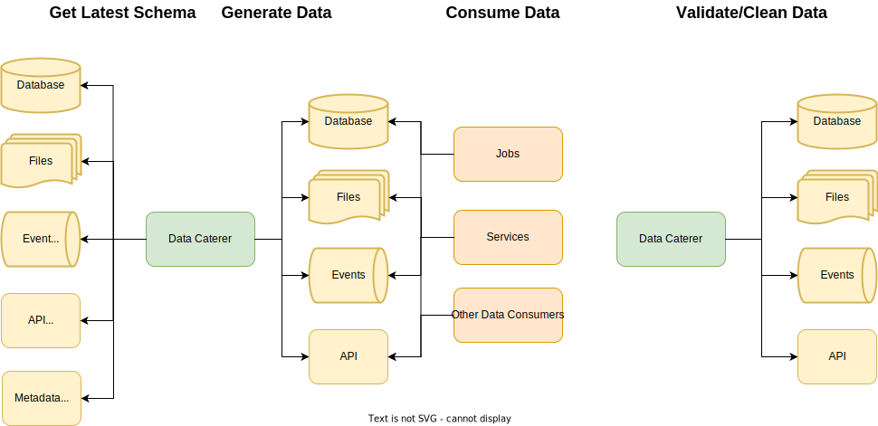

# Use cases

## Replicate production in lower environment

Having a stable and reliable test environment is a challenge for a number of companies, especially where teams are
asynchronously deploying and testing changes at faster rates. Data Caterer can help alleviate these issues by doing
the following:

1. Generates data with the latest schema changes and production like field values
2. Run as a job on a daily/regular basis to replicate production traffic or data flows
3. Validate data to ensure your system runs as expected
4. Clean up data to avoid build up of generated data

## Local development

Similar to the above, being able to replicate production like data in your local environment can be key to developing
more reliable code as you can test directly against data in your local computer. This has a number of benefits
including:

1. Fewer assumptions or ambiguities when the developer codes
2. Direct feedback loop in local computer rather than waiting for test environment for more reliable test data
3. No domain expertise required to understand the data
4. Easy for new developers to be onboarded and developing/testing code for jobs/services

## System/integration testing

When working with third-party, external or internal data providers, it can be difficult to have all setup ready to
produce reliable data that abides by relationship contracts between each of the systems. You have to rely on these data
providers in order for you to run your tests which may not align to their priorities. With Data Caterer, you can
generate the same data that they would produce, along with maintaining referential integrity across the data providers,
so that you can run your tests without relying on their systems being up and reliable in their corresponding
lower environments.

## Scenario testing

If you want to set up particular data scenarios, you can customise the generated data to fit your scenario. Once the
data gets generated and is consumed, you can also run validations to ensure your system has consumed the data correctly.
These scenarios can be put together from existing tasks or data sources can be enabled/disabled based on your
requirement. Built into Data Caterer and controlled via feature flags, is the ability to test edge cases based on the
data type of the fields used for data generation (`enableEdgeCases` flag within `<field>.generator.options`, see more
[**here**](../setup/generator/generator.md)).

## Data debugging

When data related issues occur in production, it may be difficult to replicate in a lower or local environment. It could
be related to specific fields not containing expected results, size of data is too large or missing corresponding
referenced data. This becomes key to resolving the issue as you can directly code against the exact data scenario and
have confidence that your code changes will fix the problem. Data Caterer can be used to generate the appropriate data
in whichever environment you want to test your changes against.

## Data profiling

When using Data Caterer with the feature flag `enableGeneratePlanAndTasks` enabled
(see [**here**](../setup/configuration.md)), metadata relating all the fields defined in the data sources you have
configured will be generated via data profiling. You can run this as a standalone job (can disable `enableGenerateData`) 
so that you can focus on the profile of the data you are utilising. This can be run against your production data sources 
to ensure the metadata can be used to accurately generate data in other environments. This is a key feature of Data 
Caterer as no direct production connections need to be maintained to generate data in other environments (which can 
lead to serious concerns about data security as seen [**here**](business-value.md)).

## Schema gathering

When using Data Caterer with the feature flag `enableGeneratePlanAndTasks` enabled
(see [**here**](../setup/configuration.md)), all schemas of the data sources defined will be tracked in a common format (as
tasks). This data, along with the data profiling metadata, could then feed back into your schema registries to help keep
them up to date with your system.
